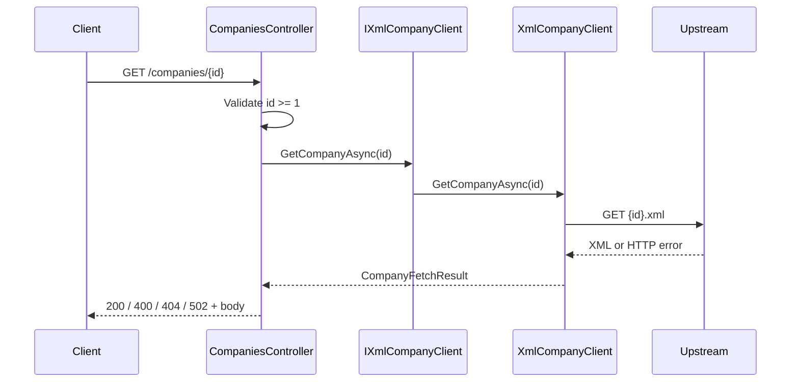

# Companies API

ASP.NET Core 9 controller-based API that exposes `GET /companies/{id}`, loads company XML from a static upstream host, maps it to JSON, and returns structured errors when validation or upstream handling fails.

## Architecture



Request path in code:

```
GET /companies/{id}
  → CompaniesController  (validates id, maps result to HTTP)
  → IXmlCompanyClient    (abstraction, swap-friendly for tests)
  → XmlCompanyClient     (HTTP GET, XML parse, structured result)
  → upstream XML host
```

## Design decisions

- **Controllers vs minimal APIs** — Controllers were chosen for conventional routing, `[ProducesResponseType]` attributes for OpenAPI, and clarity. A minimal API would work equally well and is slightly leaner; the same layering (`IXmlCompanyClient`) would apply.
- **`IXmlCompanyClient`** — Decouples the controller from HTTP transport. Integration tests replace the implementation with a stub so you do not need to mock `HttpClient` at the controller boundary.
- **`CompanyFetchResult` instead of exceptions for upstream failures** — Non-2xx HTTP responses and parse errors are expected operational outcomes, not exceptional control flow. A typed result keeps every branch explicit at the call site.
- **`AddStandardResilienceHandler`** — Retries, timeouts, circuit breaker, and related policies from **Microsoft.Extensions.Http.Resilience**. Trade-off: the upstream GET may be retried; that is acceptable because reads are idempotent.
- **`ApiError` with `error` / `error_description`** — Aligns with common OAuth 2.0-style error payloads and reads clearly in logs and clients.

## Prerequisites

- **.NET 9 SDK** (for `dotnet run` / `dotnet test`), **or**
- **Docker** (for build/run without a local SDK)

## Run locally

From the repository root:

```bash
dotnet run --project src/CompaniesApi/CompaniesApi.csproj
```

The app listens on **http://localhost:5000** (see `src/CompaniesApi/Properties/launchSettings.json`). In **Development**, Swagger UI is at **http://localhost:5000/swagger**.

## Run with Docker

```bash
docker build -t companies-api .
docker run -e ASPNETCORE_ENVIRONMENT=Development -p 5000:8080 companies-api
```

`ASPNETCORE_ENVIRONMENT=Development` enables Swagger UI, consistent with [Run locally](#run-locally). Then open **http://localhost:5000/swagger** to try the API.

## Tests

```bash
dotnet test --logger "console;verbosity=detailed"
```

### HTML test report

Writes a file you can open in a browser (path is printed at the end of the test run; often under `TestResults/`):

```bash
dotnet test --logger "html;LogFileName=TestResults.html" --results-directory ./TestResults
```

Open `TestResults/TestResults.html` (exact folder may vary; check the test output for the full path).

### Code coverage as HTML

One-time global tool install:

```bash
dotnet tool install -g dotnet-reportgenerator-globaltool
```

Collect coverage:

```bash
dotnet test --collect:"XPlat Code Coverage" --results-directory ./coverage
```
Generate a report:
```bash
reportgenerator -reports:"./coverage/**/coverage.cobertura.xml" -targetdir:coverage-report -reporttypes:Html
```

Open `coverage-report/index.html`.


## Try the API (Swagger)

With the app running, open **Swagger UI** at **http://localhost:5000/swagger** (Development; see [Run locally](#run-locally) or [Run with Docker](#run-with-docker)). Use **GET /companies/{id}** and **Try it out** — no `curl` needed.

Assuming the configured upstream is reachable, you can exercise the same cases as below:

| Case | `id` | Expected |
|------|------|----------|
| **200** — existing company | `1` | JSON for the first sample company |
| **200** — second sample | `2` | JSON for the second sample company |
| **400** — invalid id | `0` (or any non-positive integer) | **400** with `ApiError` |
| **404** — not found upstream | `999999` | **404** with `ApiError` |
| **502** — upstream/network/parse failure | (depends on upstream) | Returned when the upstream errors, the request times out, or XML cannot be parsed; invalid upstream XML typically yields **502** with an `Upstream Error` body |

Swagger shows response status and body for each call.

## Configuration

| Setting           | Purpose |
|------------------|---------|
| `UpstreamBaseUrl` | Base URL for `{id}.xml` requests (see `src/CompaniesApi/appsettings.json`). |

## Behavior summary

| Scenario                         | HTTP status | Body shape |
|----------------------------------|------------|------------|
| `id < 1`                         | 400        | `ApiError` (`error`, `error_description`) |
| Upstream 404                     | 404        | `ApiError` |
| Upstream 5xx, network, timeout, bad XML | 502 | `ApiError` |
| Success                          | 200        | `Company` (`id`, `name`, `description`) |

The HTTP client uses **Microsoft.Extensions.Http.Resilience** (`AddStandardResilienceHandler`) for retries and timeouts. Structured logs include upstream URL, status codes, and parse failures.
